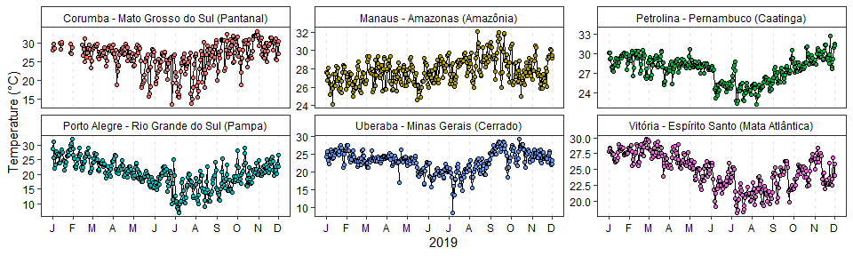
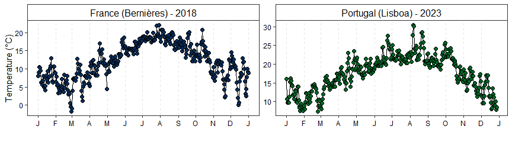

DataMetProcess Applications
================
Wagner Martins dos Santos
2024-06-16

- [Brazilian biomes](#brazilian-biomes)
  - [Loading Packages](#loading-packages)
  - [Downloading and Unzipping INMET
    Data](#downloading-and-unzipping-inmet-data)
  - [Reading Brazilian Biomes](#reading-brazilian-biomes)
  - [Processing Stations](#processing-stations)
  - [Analyzing Meteorological Data](#analyzing-meteorological-data)
  - [Data Visualization](#data-visualization)
- [Other databases](#other-databases)
  - [Loading Packages](#loading-packages-1)
  - [Data Loading and Preprocessing](#data-loading-and-preprocessing)
    - [France](#france)
    - [Portugal](#portugal)
  - [Converting Dates](#converting-dates)
  - [Calculating Daily Mean
    Temperature](#calculating-daily-mean-temperature)
    - [France](#france-1)
    - [Portugal](#portugal-1)
  - [Combining and Visualizing Data](#combining-and-visualizing-data)

# Brazilian biomes

## Loading Packages

``` r
library(geobr)
```

    ## Loading required namespace: sf

``` r
library(ggplot2)
library(DataMetProcess)
library(sf)
```

    ## Linking to GEOS 3.11.2, GDAL 3.8.2, PROJ 9.3.1; sf_use_s2() is TRUE

## Downloading and Unzipping INMET Data

First, we list and download the data from meteorological stations for
the year 2019.

``` r
inmet_list <-list_inmet(year = 2019,filename = "./inmet.zip")

FilesSaveUnzip <-utils::unzip(zipfile = inmet_list$Saved,exdir = "./inmet_2019")
```

## Reading Brazilian Biomes

We load the data of Brazilian biomes and exclude the “Marine” biome.

``` r
biomes <- geobr::read_biomes()
```

    ## Using year/date 2019

``` r
biomes <- biomes[-7,]
biomes$name_biome
```

## Processing Stations

We select a few representative stations for each biome.

``` r
EstacoesProcess <- data.frame(
  biome = biomes$name_biome,
  id = c("A101", "A307", "A568", "A612", "A801", "A724"),
  city = c(
    "Manaus - Amazonas", "Petrolina - Pernambuco",
    "Uberaba - Minas Gerais", "Vitória - Espírito Santo",
    "Porto Alegre - Rio Grande do Sul", "Corumba - Mato Grosso do Sul"
  )
)

EstacoesProcess$city_biome <- 
  paste0(EstacoesProcess$city," (",EstacoesProcess$biome,")")

EstacoesProcess
```

    ##            biome   id                             city
    ## 1       Amazônia A101                Manaus - Amazonas
    ## 2       Caatinga A307           Petrolina - Pernambuco
    ## 3        Cerrado A568           Uberaba - Minas Gerais
    ## 4 Mata Atlântica A612         Vitória - Espírito Santo
    ## 5          Pampa A801 Porto Alegre - Rio Grande do Sul
    ## 6       Pantanal A724     Corumba - Mato Grosso do Sul
    ##                                  city_biome
    ## 1              Manaus - Amazonas (Amazônia)
    ## 2         Petrolina - Pernambuco (Caatinga)
    ## 3          Uberaba - Minas Gerais (Cerrado)
    ## 4 Vitória - Espírito Santo (Mata Atlântica)
    ## 5  Porto Alegre - Rio Grande do Sul (Pampa)
    ## 6   Corumba - Mato Grosso do Sul (Pantanal)

## Analyzing Meteorological Data

For each selected station, we read the data and calculate the daily
averages of precipitation and temperature.

``` r
EstacoesList <-
  lapply(1:nrow(EstacoesProcess), function(row) {
    file <- grep(EstacoesProcess$id[row], FilesSaveUnzip, value = TRUE)
    df <- read.table(file, skip = 8, sep = ";", dec = ",", header = TRUE, check.names = FALSE)
    df <- df[c(1:3, 8)]
    colnames(df) <- c("Date", "Hora", "Precipitation", "Temperature")
    df$Date <- as.Date(df$Date, format = "%Y/%m/%d")
    df <- adjustDate(data = df, col_date = "Date", col_hour = "Hora", fuso = "America/Bahia")
    df$Date_Hour <- as.Date(df$Date_Hour)
    df_diario <- calculateDMY(
      data = df,
      col_date = "Date_Hour",
      col_sum = "Precipitation",
      col_mean = "Temperature"
    )
    df_diario$city <- EstacoesProcess$city_biome[row]
    
    df_diario
  })

names(EstacoesList) <- EstacoesProcess$city_biome

EstacoesList[[1]]
```

    ## # A tibble: 366 x 4
    ##    Date       Precipitation Temperature city                        
    ##    <date>             <dbl>       <dbl> <chr>                       
    ##  1 2018-12-31           0          26.6 Manaus - Amazonas (Amazônia)
    ##  2 2019-01-01          15          27.6 Manaus - Amazonas (Amazônia)
    ##  3 2019-01-02           1.8        26.8 Manaus - Amazonas (Amazônia)
    ##  4 2019-01-03           0.8        27.5 Manaus - Amazonas (Amazônia)
    ##  5 2019-01-04           0.2        28.1 Manaus - Amazonas (Amazônia)
    ##  6 2019-01-05          12.6        27.2 Manaus - Amazonas (Amazônia)
    ##  7 2019-01-06           1.6        26.4 Manaus - Amazonas (Amazônia)
    ##  8 2019-01-07           2.2        25.2 Manaus - Amazonas (Amazônia)
    ##  9 2019-01-08           0.6        26.2 Manaus - Amazonas (Amazônia)
    ## 10 2019-01-09           0.4        26.3 Manaus - Amazonas (Amazônia)
    ## # i 356 more rows

## Data Visualization

We create a plot to visualize the daily temperature variations
throughout 2019.

``` r
do.call("rbind", EstacoesList) |>
  ggplot(aes(x = Date, y = Temperature, fill = city)) +
  geom_line() +
  geom_point(pch = 21) +
  geom_vline(
    xintercept = seq.Date(as.Date("2019-01-01"), as.Date("2019-12-01"), by = "month"),
    linetype = "dashed",
    alpha = 0.1
  ) +
  scale_x_date(
    labels = function(x) substr(format(as.Date(x), "%b"), 1, 1),
    date_breaks = "month",
    limits = c(as.Date("2019-01-01"), as.Date("2019-12-01"))
  ) +
  labs(
    y = "Temperature (°C)",
    x = "2019"
  ) +
  facet_wrap(~ city, scales = "free_y") +
  theme_bw() +
  theme(
    legend.position = "none",
    axis.text = element_text(color = "black"),
    strip.background = element_rect(fill = "white"),
    strip.text = element_text(color = "black"),
    panel.grid = element_blank()
  )
```

    ## Warning: Removed 186 rows containing missing values or values outside the scale range
    ## (`geom_line()`).

    ## Warning: Removed 219 rows containing missing values or values outside the scale range
    ## (`geom_point()`).

<!-- -->

# Other databases

## Loading Packages

``` r
library(ggplot2)
library(tidyverse)
```

    ## -- Attaching core tidyverse packages ------------------------ tidyverse 2.0.0 --
    ## v dplyr     1.1.4     v readr     2.1.5
    ## v forcats   1.0.0     v stringr   1.5.1
    ## v lubridate 1.9.3     v tibble    3.2.1
    ## v purrr     1.0.2     v tidyr     1.3.1
    ## -- Conflicts ------------------------------------------ tidyverse_conflicts() --
    ## x dplyr::filter() masks stats::filter()
    ## x dplyr::lag()    masks stats::lag()
    ## i Use the conflicted package (<http://conflicted.r-lib.org/>) to force all conflicts to become errors

``` r
library(DataMetProcess)
```

## Data Loading and Preprocessing

### France

We load and preprocess the temperature data for France, converting the
temperature from Kelvin to Celsius and formatting the date.

``` r
dataFrance <- data.table::fread(file = "./Outros/NW2018.csv")
dataFrance <-
  dataFrance |>
  as_tibble() |>
  filter(number_sta == 14066001) |>
  select(date, t) |>
  mutate(
    date = strptime(date, format = "%Y%m%d %H:%M"),
    t = t - 273.15
  ) |>
  rename(Date = "date", Temperature = "t")

dataFrance
```

    ## # A tibble: 87,550 x 2
    ##    Date                Temperature
    ##    <dttm>                    <dbl>
    ##  1 2018-01-01 00:00:00        6.10
    ##  2 2018-01-01 00:06:00        6.10
    ##  3 2018-01-01 00:12:00        6.20
    ##  4 2018-01-01 00:18:00        6.20
    ##  5 2018-01-01 00:24:00        6.40
    ##  6 2018-01-01 00:30:00        6.30
    ##  7 2018-01-01 00:36:00        6.20
    ##  8 2018-01-01 00:42:00        6.20
    ##  9 2018-01-01 00:48:00        6.40
    ## 10 2018-01-01 00:54:00        6.70
    ## # i 87,540 more rows

### Portugal

We load and preprocess the temperature data for Portugal, converting the
date to a proper format.

``` r
dataPortugal <- readxl::read_xlsx("./Outros/lisboa_pt.xlsx")
```

    ## Warning: Expecting numeric in E8177 / R8177C5: got '1,802.61'

    ## Warning: Expecting numeric in E16824 / R16824C5: got '1,802.61'

``` r
dataPortugal <-
  dataPortugal |>
  select(Data, `Temperatura (Cº)`) |>
  mutate(Data = strptime(Data, format = "%Y-%m-%d %H:%M:%S")) |>
  rename(Date = "Data", Temperature = "Temperatura (Cº)")

dataPortugal
```

    ## # A tibble: 17,305 x 2
    ##    Date                Temperature
    ##    <dttm>                    <dbl>
    ##  1 2023-01-01 00:00:00        17.5
    ##  2 2023-01-01 00:30:00        17.6
    ##  3 2023-01-01 01:00:00        17.4
    ##  4 2023-01-01 01:30:00        17.3
    ##  5 2023-01-01 02:00:00        17.1
    ##  6 2023-01-01 02:30:00        16.9
    ##  7 2023-01-01 03:00:00        17.3
    ##  8 2023-01-01 03:30:00        17.3
    ##  9 2023-01-01 04:00:00        17.4
    ## 10 2023-01-01 04:30:00        17.4
    ## # i 17,295 more rows

## Converting Dates

“We converted the date format for the dataset from France so that the
dates are uniquely differentiated by hours.”

``` r
dataFrance <-
  dataFrance |>
  mutate(
    Date = as.POSIXct(format(Date), format = "%Y-%m-%d %H")
  )

dataFrance
```

    ## # A tibble: 87,550 x 2
    ##    Date                Temperature
    ##    <dttm>                    <dbl>
    ##  1 2018-01-01 00:00:00        6.10
    ##  2 2018-01-01 00:00:00        6.10
    ##  3 2018-01-01 00:00:00        6.20
    ##  4 2018-01-01 00:00:00        6.20
    ##  5 2018-01-01 00:00:00        6.40
    ##  6 2018-01-01 00:00:00        6.30
    ##  7 2018-01-01 00:00:00        6.20
    ##  8 2018-01-01 00:00:00        6.20
    ##  9 2018-01-01 00:00:00        6.40
    ## 10 2018-01-01 00:00:00        6.70
    ## # i 87,540 more rows

## Calculating Daily Mean Temperature

### France

``` r
dataFrance_byhour <-
  calculateDMY(
    data = dataFrance,
    col_date = "Date",
    col_mean = "Temperature"
  )

dataFrance_Daily <-
  dataFrance_byhour |>
  mutate(Date = as.Date(Date)) |>
  calculateDMY(
    col_date = "Date",
    col_mean = "Temperature"
  )
```

### Portugal

``` r
dataPortugal_Daily <-
  dataPortugal |>
  mutate(Date = as.Date(Date)) |>
  calculateDMY(
    col_date = "Date",
    col_mean = "Temperature"
  )
```

## Combining and Visualizing Data

We combine the processed datasets from France and Portugal and create a
plot to visualize the temperature variations.

``` r
dataFrance_Daily |>
  mutate(Pais = "France (Bernières) - 2018") |>
  bind_rows(
    dataPortugal_Daily |>
      mutate(Pais = "Portugal (Lisboa) - 2023")
  ) |>
  ggplot(aes(Date, Temperature, fill = Pais, group = 1)) +
  geom_line() +
  geom_point(pch = 21, size = 2) +
  geom_vline(
    xintercept = seq.Date(as.Date("2018-01-01"), as.Date("2023-12-01"), by = "month"),
    linetype = "dashed",
    alpha = 0.1
  ) +
  scale_x_date(
    labels = function(x) substr(format(as.Date(x), "%b"), 1, 1),
    date_breaks = "month"
  ) +
  facet_wrap(~Pais, scales = "free") +
  scale_fill_manual(values = c("#082d59", "#006425")) +
  labs(
    y = "Temperature (°C)",
    x = ""
  ) +
  theme_bw() +
  theme(
    legend.position = "none",
    axis.text = element_text(color = "black"),
    strip.background = element_rect(fill = "white"),
    strip.text = element_text(color = "black", size = 12),
    panel.grid = element_blank()
  )
```

    ## Warning: Removed 1 row containing missing values or values outside the scale range
    ## (`geom_point()`).

<!-- -->
